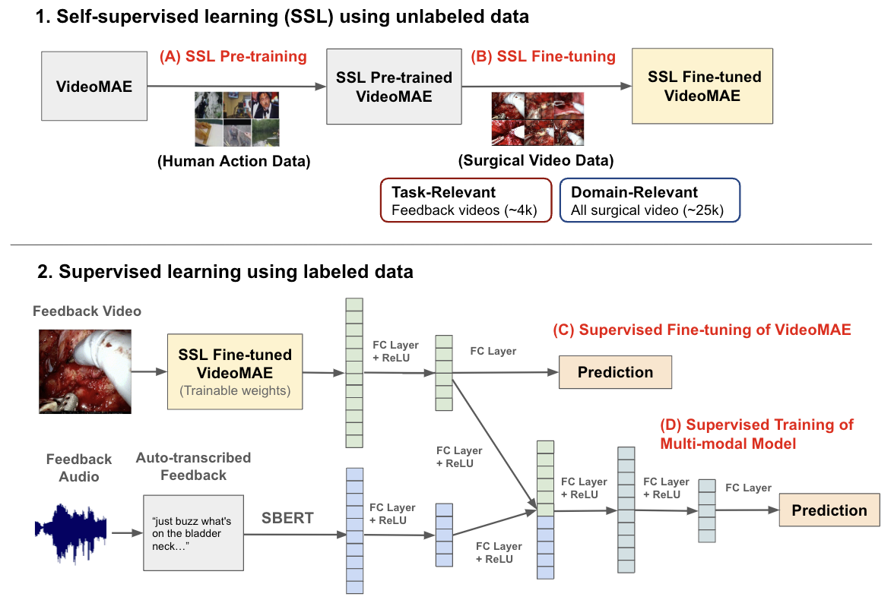

# Multi-Modal Self-Supervised Learning for Surgical Feedback Effectiveness Assessment

**Authors:** Arushi Gupta\*, Rafal Kocielnik\*, Jiayun Wang, Firdavs Nasriddinov, Cherine Yang, Elyssa Wong, Anima Anandkumar, Andrew J. Hung

This repository contains the code for the paper **"Multi-Modal Self-Supervised Learning for Surgical Feedback Effectiveness Assessment"**. The paper is accepted at ML4H 2024. We open-source all code and results under a permissive MIT license to encourage reproducibility and further research exploration.

*Overview of the multi-modal model pipeline for predicting trainee behavior change.*

# Overview
During surgical training, real-time feedback from trainers to trainees is important for preventing errors and enhancing long-term skill acquisition. Accurately predicting the effectiveness of this feedback, specifically whether it leads to a change in trainee behavior, is crucial for developing methods for improving surgical training and education. However, relying on human annotations to assess feedback effectiveness is laborious and prone to biases, underscoring the need for an automated, scalable, and objective method. Creating such an automated system poses challenges, as it requires an understanding of both the verbal feedback delivered by the trainer and the visual context of the real-time surgical scene. To address this, **we propose a method that integrates information from transcribed verbal feedback and corresponding surgical video to predict feedback effectiveness**. Our findings show that both transcribed feedback and surgical video are individually predictive of trainee behavior changes, and their combination achieves an AUROC of $0.70\pm0.02$, improving prediction accuracy by up to 6.6\%. Additionally, we introduce self-supervised fine-tuning as a strategy for enhancing surgical video representation learning, which is scalable and further enhances prediction performance. Our results demonstrate the potential of multi-modal learning to advance the automated assessment of surgical feedback.

# Code Overview
The code for running the self-supervised pretraining/fine-tuning of VideoMAE is in pretrain_videomae.py

The pipeline for running supervised fine-tuning of VideoMAE, supervised training of the multi-modal model, and supervised training of text includes the following:

1. Run *save_data.py* to save video data that is preprocessed for VideoMAE, SBERT text features, and labels (i.e., trainee behavior change labels)
2. **To perform supervised fine-tuning of VideoMAE**: Run *finetune_videomae.py* which uses the dataset generated from the previous step to then fine-tune VideoMAE for a prediction task. This will generate a directory that contains VideoMAE features (for the train and test sets), SBERT features (for the train and test sets), and fine-tuned VideoMAE model across all epochs of training.
3. **To perform supervised training of multi-modal model**: Run *finetune_multimodal.py* that uses the directory generated by Step 2 to perform multi-modal training of the VideoMAE features and SBERT features at a specific epoch for the prediction task. 
4. **To perform supervised training of text**: Run *train_text.py* which uses the directory generated by Step 2 to perform training of the SBERT features for the prediction task.

